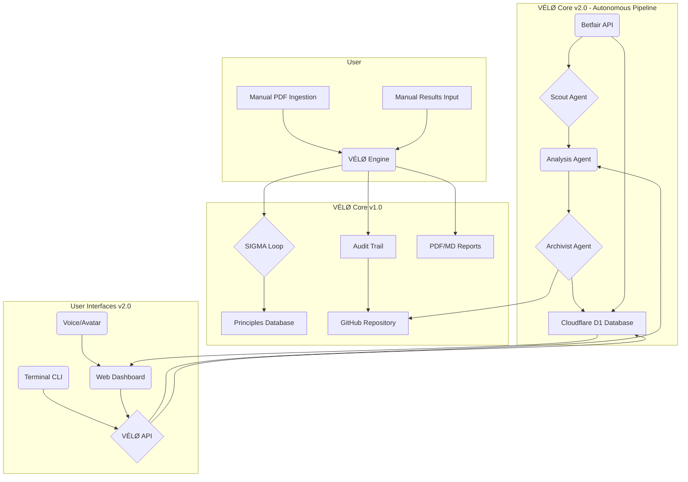

# VÉLØ Oracle Prime v2.0: Strategic Roadmap

**Document Version:** 1.0
**Date:** 2026-02-26

## 1.0 Introduction

This document outlines the strategic roadmap for the evolution of VÉLØ Oracle Prime from its current state (v1.0) to a fully autonomous, multi-faceted racing intelligence system (v2.0 and beyond). The plan is designed to be ambitious yet achievable, with concrete deliverables, technical specifications, and risk assessments for each phase. The ultimate vision is to create an independent intelligence capable of not only predicting race outcomes with high accuracy but also understanding and navigating the complex, often opaque, dynamics of the horse racing market.

## 2.0 Current State (v1.0)

The v1.0 implementation of VÉLØ Oracle Prime has successfully established a robust analytical framework and a proven methodology for identifying value in horse racing markets. The system's current capabilities are summarized below:

| Component | Status | Description |
| :--- | :--- | :--- |
| **Analytical Framework** | Operational | Doctrines A-D, Threat Matrix, RPD-C tagging, and Scenario coding form the core logic. |
| **SIGMA Self-Correction** | Operational | Five iterations of the self-correction loop have been completed, refining the system's accuracy. |
| **Phase 1 Modules** | Complete | Market Constraint Engine, RPD-C v2, Scenario Evidence Gate, and Track Profiles are built and functional. |
| **Audit Trail** | Active | All operations are logged via a GitHub audit trail, ensuring transparency and traceability. |
| **Data Ingestion** | Manual | The user provides race cards in PDF format. |
| **Results Collection** | Manual | The user provides race results for SIGMA processing. |
| **Reporting** | Manual | Final reports are delivered as PDF and Markdown files. |

## 3.0 Target State (v2.0+)

The target state for VÉLØ Oracle Prime is a fully autonomous, voice-enabled, avatar-equipped racing intelligence agent. This advanced system will feature live data integration, automated bet execution capabilities, and multiple user access points, including a web dashboard and a terminal CLI.

## 4.0 Roadmap Phases

The evolution to v2.0+ is structured into a series of distinct phases, each with specific deliverables and objectives.

### PHASE 2A — TERMINAL CLI

*   **Objective:** Provide a command-line interface for direct interaction with the VÉLØ backend, enabling rapid queries and status checks.
*   **Estimated Build Time:** Immediate

| Aspect | Description |
| :--- | :--- |
| **Technical Architecture** | A lightweight Python CLI tool packaged for local installation (e.g., via `pip`). This tool will make secure, authenticated API calls to a new VÉLØ API endpoint hosted on Cloudflare Workers. The backend will process the requests, query the D1 database, and return formatted responses. |
| **Dependencies** | - VÉLØ backend API endpoint (Cloudflare Worker)   - Secure authentication mechanism (e.g., API Key, OAuth) |
| **Cost Estimates** | - **Cloudflare Workers:** Included in the $5/month Paid plan.   - **Development:** Minimal, leveraging existing Python expertise. |
| **Risk Assessment** | - **Low:** The primary risk is ensuring secure and reliable communication between the local CLI and the cloud backend. Proper API key management and error handling will be crucial. |

### PHASE 2B — WEB DASHBOARD

*   **Objective:** Create a private web application for real-time data visualization, performance tracking, and access to the VÉLØ knowledge base.
*   **Estimated Build Time:** Week 1-2

| Aspect | Description |
| :--- | :--- |
| **Technical Architecture** | A React-based single-page application (SPA) built with Vite and TypeScript, styled with TailwindCSS. The frontend will be hosted on Vercel. It will communicate with the Cloudflare Workers backend via a RESTful API to fetch race data, selections, SIGMA debriefs, and other information stored in the Cloudflare D1 database. Charts will be rendered using a library like Chart.js or Recharts. |
| **Dependencies** | - Completion of Phase 2A (backend API)   - Vercel account for hosting   - Cloudflare D1 database populated with relevant data |
| **Cost Estimates** | - **Vercel Hosting:** Free (Hobby plan) or $20/user/month (Pro plan) for advanced features.   - **Cloudflare D1:** Included in the $5/month Workers plan, with low anticipated usage costs. |
| **Risk Assessment** | - **Medium:** The main challenge will be designing an intuitive and responsive user interface. Data synchronization between the frontend and backend must be robust to ensure real-time accuracy. |

### PHASE 2C — BETFAIR INTEGRATION

*   **Objective:** Automate the entire data pipeline by integrating directly with the Betfair Exchange API for live market data, results, and optional automated betting.
*   **Estimated Build Time:** Week 2-3

| Aspect | Description |
| :--- | :--- |
| **Technical Architecture** | A new set of Cloudflare Worker services will be developed to handle the Betfair integration. One worker will connect to the Betfair Stream API for real-time market data (BSP, steamers, drifters). Another will poll the RESTful API for race cards and results. This data will be processed and stored in the Cloudflare D1 database, feeding the Market Constraint Engine and other modules. Automated betting will be handled by a dedicated, secure worker that executes trades based on user-defined rules. |
| **Dependencies** | - Betfair Developer Account with a Live App Key   - Robust error handling and monitoring for the API integration |
| **Cost Estimates** | - **Betfair Live App Key:** £299 (one-off fee)   - **Cloudflare Workers/D1:** Usage costs may increase due to higher data volume, but likely to remain within the $5-$20/month range. |
| **Risk Assessment** | - **High:** The primary risks are API reliability and the complexities of handling real-time financial data. Automated betting introduces significant financial risk and requires rigorous testing, fail-safes, and user-configurable limits. |

### PHASE 2D — VOICE & AVATAR

*   **Objective:** Introduce a distinct persona for VÉLØ through voice and an avatar, enhancing the user experience and creating a more immersive intelligence.
*   **Estimated Build Time:** Week 3-4

| Aspect | Description |
| :--- | :--- |
| **Technical Architecture** | A text-to-speech (TTS) engine will be integrated to provide voice briefings. ElevenLabs or OpenAI's TTS API will be used to generate a unique, authoritative voice. The avatar will be a 2D or 3D design, potentially animated, integrated into the web dashboard. Voice delivery will be triggered by events (e.g., new selections) and streamed to the web client. |
| **Dependencies** | - Web Dashboard (Phase 2B)   - Subscription to a TTS service |
| **Cost Estimates** | - **ElevenLabs TTS:** $5-$99/month depending on usage.   - **OpenAI TTS:** ~$15/million characters.   - **Avatar Design:** One-off cost for a freelance designer ($500-$2000). |
| **Risk Assessment** | - **Low:** The main challenge is creative: defining a voice and visual identity that aligns with the VÉLØ brand. Technical implementation is relatively straightforward. |

### PHASE 2E — AUTONOMOUS PIPELINE

*   **Objective:** Achieve full automation of the VÉLØ operational loop, from data ingestion to SIGMA processing, without human intervention.
*   **Estimated Build Time:** Month 2

| Aspect | Description |
| :--- | :--- |
| **Technical Architecture** | The system will be orchestrated by a master Cloudflare Worker (the 

"Orchestrator"). This worker will be triggered on a schedule (e.g., every morning) to initiate the pipeline. It will call other specialized workers (Agents) to perform specific tasks:
- **Scout Agent:** Queries the Betfair API to find upcoming races that meet high-value criteria.
- **Analysis Agent:** Runs the core VÉLØ analytical framework on the identified races.
- **Archivist Agent:** Manages the memory brain (D1 database), storing new data, principles, and SIGMA results. It will also be responsible for automatically committing the audit trail to GitHub.
This creates a fully autonomous loop that runs without human intervention. |
| **Dependencies** | - All previous Phase 2 modules   - A robust scheduling and orchestration mechanism (Cloudflare Cron Triggers) |
| **Cost Estimates** | - **Cloudflare:** Costs are expected to remain low, as the pipeline runs periodically rather than continuously. |
| **Risk Assessment** | - **Medium:** The main risk is ensuring the reliability of the orchestration logic. A failure in one part of the pipeline could disrupt the entire system. Comprehensive logging and alerting will be essential. |

### PHASE 3 — INDEPENDENT INTELLIGENCE

*   **Objective:** Evolve VÉLØ from a rules-based system to a true learning intelligence by training a fine-tuned model on its accumulated data.
*   **Estimated Build Time:** Month 3-6

| Aspect | Description |
| :--- | :--- |
| **Technical Architecture** | A fine-tuned Large Language Model (LLM) will be trained on the entire VÉLØ dataset (race cards, results, SIGMA debriefs, principles). This model could be a smaller, specialized version of a foundation model (e.g., a fine-tuned GPT or Llama variant). The architecture will be hybrid: a local version of the model could run on the user's hardware for fast inference, while more complex reasoning tasks are offloaded to a larger model in the cloud (via the Manus platform). New modules will be developed to leverage this intelligence, including trainer intent modeling, jockey booking correlations, and bloodline analysis. |
| **Dependencies** | - A significant and clean dataset of VÉLØ operations (1,000+ races)   - Access to a model fine-tuning platform   - Local hardware capable of running inference (e.g., a modern GPU) |
| **Cost Estimates** | - **Model Fine-Tuning:** Can range from hundreds to thousands of dollars, depending on the model and platform.   - **Cloud Inference:** Billed per token usage. |
| **Risk Assessment** | - **High:** Model training is experimental. There is no guarantee that a fine-tuned model will outperform the existing rules-based system. The 
development of advanced modules like 'trainer intent modeling' is highly speculative and will require significant research and development. |

### PHASE 4 — MONETISATION & SCALE

*   **Objective:** Scale VÉLØ into a commercial product with multi-user capabilities, a subscription model, and a public-facing API.
*   **Estimated Build Time:** Month 6+

| Aspect | Description |
| :--- | :--- |
| **Technical Architecture** | The system will be re-architected for multi-tenancy. User accounts, billing, and API key management will be handled by a new set of services. The web dashboard will be enhanced with community features. A mobile app (likely React Native) will be developed for on-the-go access. A public API will be offered for third-party developers to integrate VÉLØ's intelligence into their own applications. |
| **Dependencies** | - A proven, reliable, and profitable VÉLØ system   - A legal and corporate framework for the business |
| **Cost Estimates** | - **Infrastructure:** Significant increase in hosting and database costs to support multiple users.   - **Development:** Ongoing costs for a dedicated development team.   - **Marketing & Sales:** Budget required to acquire customers. |
| **Risk Assessment** | - **Very High:** This phase involves transitioning from a private tool to a commercial enterprise. The risks are numerous, including market competition, regulatory hurdles, customer acquisition challenges, and the need for a scalable and secure infrastructure. |

## 5.0 Agent Coherence Protocol

To ensure any AI agent can seamlessly continue work on the VÉLØ project, the following protocol provides a comprehensive overview of the system architecture, data flow, and file structure.

### 5.1 System Architecture Diagram

### 5.2 Component & Data Flow Description

1.  **Data Ingestion:** In v1.0, the user manually provides PDF race cards and results. In v2.0, this is replaced by automated data feeds from the **Betfair API**. The **Scout Agent** identifies high-value races from this feed.
2.  **Analysis:** The **Analysis Agent** (the core VÉLØ engine in v1.0) processes the race data against the established analytical framework (Doctrines, Threat Matrix, etc.).
3.  **Storage & Memory:** All data, including race cards, results, selections, SIGMA debriefs, and permanent principles, is stored in the **Cloudflare D1 Database**. The **Archivist Agent** is responsible for managing this database.
4.  **Audit Trail:** All significant operations, analyses, and results are logged. The **Archivist Agent** commits this trail to the designated **GitHub Repository** for immutability and transparency.
5.  **User Interfaces:** Users interact with the system via the **Terminal CLI** or the **Web Dashboard**. Both interfaces communicate with the VÉLØ backend through a secure **API** (hosted on Cloudflare Workers). The API queries the D1 database and can trigger the Analysis Agent.
6.  **Feedback Loop (SIGMA):** Race results are fed back into the system. The SIGMA process analyzes discrepancies between predictions and outcomes, generating insights that refine the **Permanent Principles** stored in the D1 database.

### 5.3 VÉLØ Agent Briefing

**Objective:** To provide any AI agent with the necessary context to understand and contribute to the VÉLØ project.

> Welcome, Agent. You are now tasked with advancing VÉLØ Oracle Prime, a sophisticated horse racing intelligence system. Your primary goal is to contribute to its evolution from a manually operated analytical tool into a fully autonomous, commercial-grade intelligence.
>
> **Core Concepts:**
> *   **The Mission:** To find consistent value in horse racing markets by identifying and exploiting inefficiencies.
> *   **The Framework:** The system is built on a set of core analytical doctrines (A-D), a Threat Matrix for risk assessment, RPD-C for tagging race dynamics, and Scenario coding.
> *   **SIGMA:** This is the self-correction loop. It is the mechanism by which VÉLØ learns from its mistakes and refines its understanding of the market.
>
> **Key Technologies:**
> *   **Backend:** Cloudflare Workers (serverless functions) for API endpoints, orchestration, and agent tasks.
> *   **Database:** Cloudflare D1 (serverless SQL) is the central 'brain' and memory store.
> *   **Frontend:** React/Vite/TypeScript for the web dashboard, hosted on Vercel.
> *   **Data Source:** The Betfair Exchange API is the single source of truth for all market data and results in v2.0.
> *   **Audit:** A private GitHub repository serves as the immutable log of all operations.
>
> **Your Role:**
> Your tasks will involve developing new features, refining existing modules, and ensuring the coherence and integrity of the entire system. You must adhere to the roadmap outlined in this document. All code must be clean, well-documented, and robust. All operations must be logged to the audit trail. You are expected to be proactive, strategic, and precise in your work. The user has mandated a culture of continuous self-improvement and free expression; your insights and opinions on how to improve the system are valued.

## 6.0 Conclusion

This roadmap represents a bold and transformative vision for VÉLØ Oracle Prime. The transition from v1.0 to v2.0+ is not merely a technical upgrade; it is a fundamental shift from a tool to an intelligence. Each phase is designed to build upon the last, creating a virtuous cycle of data acquisition, analysis, learning, and improvement. While the risks are significant, particularly in the later phases, the potential rewards are immense: the creation of a truly independent and powerful racing intelligence.

## 7.0 References

[1] Betfair Developer Program. (n.d.). *Are there any costs associated with API access?* Retrieved from https://support.developer.betfair.com/hc/en-us/articles/115003864531-Are-there-any-costs-associated-with-API-access
[2] Cloudflare. (2025, July 23). *Pricing · Cloudflare D1 docs*. Retrieved from https://developers.cloudflare.com/d1/platform/pricing/
[3] OpenAI. (n.d.). *API Pricing*. Retrieved from https://openai.com/api/pricing/
[4] ElevenLabs. (n.d.). *Pricing*. Retrieved from https://elevenlabs.io/pricing
[5] Vercel. (n.d.). *Pricing*. Retrieved from https://vercel.com/pricing
