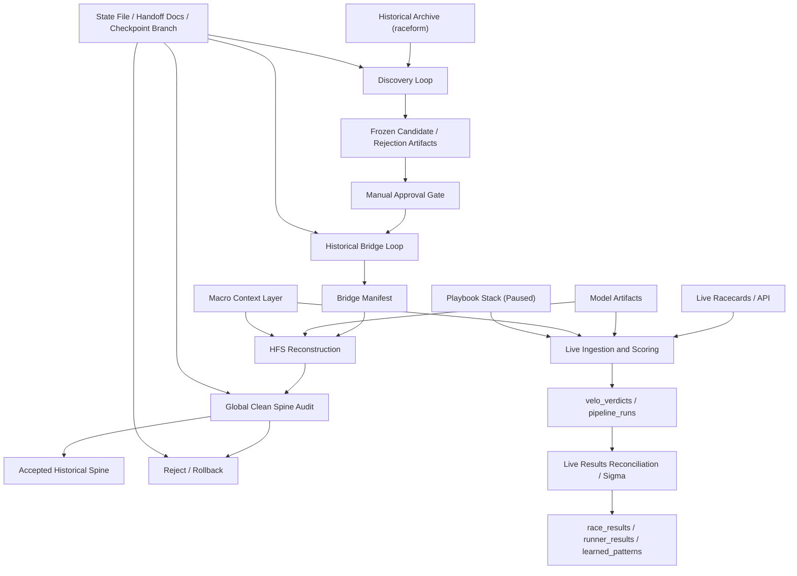

**VELO Project ETCSLV Map**

This document maps the full VELO operating system after the OASIS clean spine audit v2 checkpoint and the project-wide ETCSLV audit.

**Current Operating Position**
- Training: `paused`
- Playbook E: `paused`
- Latest accepted block: `OASIS_BLOCK_024`
- Latest failed block: `OASIS_BLOCK_025`
- Failure reason: `2025 macro-year mismatch`
- Archive exhausted: `true`
- Current accepted spine:
  - `race_results = 3201`
  - `runner_results = 31751`
  - `historical_feature_store = 31692`
  - `clean_historical_races_integrated_approx = 1913`

**Control-Plane Warning**
- Do not retry `OASIS_BLOCK_025` until `2025` macro support exists.
- Do not resume from chat memory.
- Start from [C:\Users\puror\velo-oracle-prime\data\velo_current_state.json](C:\Users\puror\velo-oracle-prime\data\velo_current_state.json).

**System Map**

**E - Execution Loops**

Historical loops:
1. Discovery loop
2. Bridge loop
3. HFS reconstruction loop
4. Global audit loop
5. Rollback/recovery loop

Live loops:
1. Live race ingestion loop
2. Live race scoring loop
3. Live result reconciliation loop
4. Racecard-to-result loop

Model and learning loops:
1. Model loading/scoring loop
2. Macro context loop
3. Training-prep loop
4. Playbook execution loop
5. Agent handoff loop

**T - Tool Registry Boundaries**

Canonical OASIS historical tools:
- `scripts/mine_clean_course_zones.py`
- `scripts/bridge_oasis_block.py`
- `scripts/backfill_historical_feature_store.py`
- `scripts/normalize_historical_provenance.py`
- `scripts/audit_hfs_signal_path.py`
- `scripts/audit_historical_macro_year.py`

Canonical live tools:
- `scripts/run_prime_today.py`
- `scripts/run_results_sigma.py`
- `app/main.py`
- `app/services/velo_prime_service.py`
- `app/services/model_manager.py`

Training and future-learning surfaces:
- `scripts/train_sqpe_v17.py`
- `scripts/train_specialist_models.py`
- `src/training/pipeline.py`
- `src/learning/auto_retrain.py`
- `app/playbooks/playbook_orchestrator.py`

Quarantine or legacy surfaces:
- `scripts/reconcile_historical_archive.py`
- top-level exploratory utilities in `scripts/`
- everything under `archive/dead_scripts/`
- overlapping `app/pipeline/*` and `src/pipelines/*` paths unless explicitly approved

**C - Context Manager**

Canonical resume state:
1. [C:\Users\puror\velo-oracle-prime\data\velo_current_state.json](C:\Users\puror\velo-oracle-prime\data\velo_current_state.json)
2. [C:\Users\puror\velo-oracle-prime\docs\VELO_AGENT_HANDOFF.md](C:\Users\puror\velo-oracle-prime\docs\VELO_AGENT_HANDOFF.md)
3. [C:\Users\puror\velo-oracle-prime\docs\VELO_AGENT_PROCESS_LIST.md](C:\Users\puror\velo-oracle-prime\docs\VELO_AGENT_PROCESS_LIST.md)
4. [C:\Users\puror\velo-oracle-prime\data\velo_artifact_index.json](C:\Users\puror\velo-oracle-prime\data\velo_artifact_index.json)
5. Latest accepted global audit artifact

Implicit-memory failures:
- Macro support state is still inferred from code and parquet range, not a dedicated state file field.
- Model version truth is still split across multiple loaders and artifact directories.
- Global audit regeneration still depends on process knowledge because no reusable script exists yet.

**S - State Store**

Project state surfaces:
- Supabase tables:
  - `races`
  - `race_results`
  - `runner_results`
  - `historical_feature_store`
  - `raceform`
  - `racing_horses`
  - `velo_verdicts`
  - `pipeline_runs`
  - `trigger_reject_events`
  - `sigma_audits`
  - `learned_patterns`
  - `historical_feature_backfill_runs`
- Local artifacts:
  - candidate JSONL files
  - rejection JSONL files
  - cursor JSON files
  - bridge manifests
  - audit JSON/MD files
  - run logs
  - state file
  - artifact index
  - handoff docs
- Recovery store:
  - checkpoint branch `checkpoint/oasis-clean-spine-audit-v2-passed`

Recommended canonical model:
- state file for mission/phase/gate truth
- manifest for scoped write truth
- audit artifacts for proof
- pipeline_runs for live run truth
- checkpoint branch for durable resumption

**L - Lifecycle Hooks**

Required hooks around every governed operation:
1. Pre-run validation
2. Dry-run where possible
3. Approval gate
4. Apply/run
5. Post-run audit
6. Rollback path
7. Artifact freeze
8. State update
9. Secret scan if committed
10. Git checkpoint after major control-plane gates
11. Next-action recommendation

Current strongest hook discipline:
- OASIS discovery/bridge/HFS/audit path

Current weakest hook discipline:
- global audit regeneration
- rollback tooling
- live loops
- macro data pack updates
- training activation
- Playbook activation

**V - Verification Interface**

Blocking checks already proven on accepted historical spine:
- parity
- winner parity
- duplicate `race_id`
- duplicate `event_key`
- duplicate `race_id + horse_id`
- no missing/orphan HFS rows
- vector length `37`
- `MPI` nulls `0`
- `chaos_bloom` nulls `0`
- macro-year mismatch `0`
- doctrine completeness
- provenance completeness
- `training_eligible = pending_global_training_gate`

Still missing project-wide standardization:
- reusable global audit script
- reusable rollback verifier
- live-vs-historical separation check
- leakage verifier
- checkpoint/secret-scan hook for all major engineering changes

**What Must Be Fixed Before Training**
- Reusable `global_clean_spine_audit`
- Reusable manifest rollback or rollback verifier
- Automated state refresh
- Unified training control plane
- Leakage/outcome-field exclusion verification

**What Must Be Fixed Before Block 025 Retry**
- `2025` macro context support
- retry preflight proving `macro_year_used = race year`
- preserve and verify rollback completeness

**Canonical Agent Startup Checklist**
1. Read [C:\Users\puror\velo-oracle-prime\data\velo_current_state.json](C:\Users\puror\velo-oracle-prime\data\velo_current_state.json).
2. Read [C:\Users\puror\velo-oracle-prime\docs\VELO_AGENT_HANDOFF.md](C:\Users\puror\velo-oracle-prime\docs\VELO_AGENT_HANDOFF.md).
3. Read [C:\Users\puror\velo-oracle-prime\docs\VELO_OASIS_RUNBOOK.md](C:\Users\puror\velo-oracle-prime\docs\VELO_OASIS_RUNBOOK.md).
4. Read the latest global audit artifact.
5. Confirm `OASIS_BLOCK_025` remains fully rolled back.
6. Confirm database counts against the state file.
7. Confirm git status and do not assume unrelated unstaged files are checkpointed.
8. Only then continue the next approved mission.

**Next Mission After This Audit**
- Review must-fix control-plane gaps.
- Build `2025` macro context support.
- Retry `OASIS_BLOCK_025`.
- Run `Global Clean Spine Audit V3`.
- Then decide the first Playbook G dry-run training gate.
