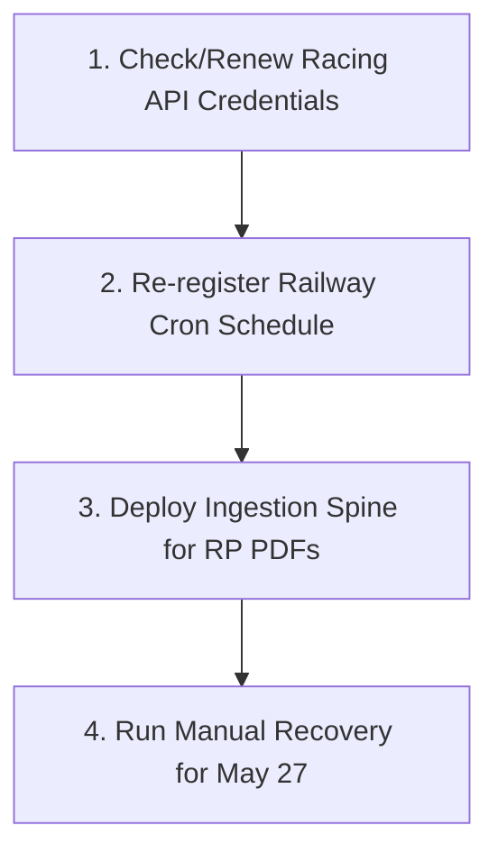

# VELO ORACLE: SYSTEM DIAGNOSIS REPORT
**Target Date:** May 27, 2026 | **Author:** Manus AI | **Escalation Owner:** PRIME_CHAIR | **Status:** CRITICAL_DATA_STARVATION

---

## 1. Executive Summary
The VÉLØ Oracle pipeline failed to execute for May 27, 2026. This is not a software crash or a logic failure, but a complete **upstream data starvation**. The pipeline's automated preflight gates [1] successfully prevented scoring because there was zero input data available—neither local cached racecards, nor local merged Racing Post (RP) PDF JSONs, nor active Racing API credentials [2]. 

This "big fail" is the result of an ongoing, systemic automation gap. An audit of the last 10 days of daily truth packets reveals that the system has been operating on a **Manual Recovery Only** basis since at least May 11, 2026 [3]. The automated crons on Railway did not deliver the required data, forcing the operator to run manual recovery scripts each day. For May 27, no manual recovery was performed, and consequently, no race day processing occurred.

---

## 2. Technical Findings & Root Cause Analysis

### Finding #1: Complete Data Absence
The pipeline is designed to look for racecards in three locations in descending priority order [2]:
1. **Local Cache:** `data/racecards_{date_tag}_standard.json`
2. **RP Merged JSONs:** `data/racecard_merged/racecard_*_{date_str}.json`
3. **Racing API:** Direct HTTP fallback (requires valid credentials)

For May 27, 2026, an inventory of the sandbox filesystem shows that **no files exist** for any date after May 19, 2026, in either the standard data directory or the merged RP directory. 

| Directory | Last Date with Data | Status for May 27 |
|---|---|---|
| `data/` (standard caches) | May 19, 2026 | **Empty** |
| `data/racecard_merged/` | May 14, 2026 | **Empty** |
| `data/velo_daily_run_truth_*.md` | May 19, 2026 | **Empty** |

### Finding #2: The Automation Gap (Railway Cron Failure)
The daily truth packets generated by the watchdog system expose a chronic issue: **the cron schedule did not run or failed silently** every day. 

```
- status: MANUAL_RECOVERY_ONLY
- cron truth: FAIL_OR_UNPROVEN
- trigger_source: manual
- status: PASS
- Warnings: AUTOMATION_DID_NOT_DELIVER
```

As documented in the `railway.toml` config, the cron schedule is intended to run daily at **09:00 UTC** [4]:
```toml
# Service: velo-prime-scoring
# Schedule: 09:00 UTC Mon-Sat
# Command: python scripts/ops/run_prime_today.py
# cronSchedule = "0 9 * * 1-6"
```
However, because Railway stores cron configurations server-side, any redeployment or configuration drift can cause the cron to be lost or de-registered [4]. Since May 11, 2026, the pipeline has only completed successfully when **manually triggered** by the operator [3]. On May 27, because no manual trigger was executed, the pipeline never ran.

### Finding #3: Preflight Gate Prevention
If the pipeline had been triggered on May 27, it would have immediately aborted due to the **Preflight Gate** [1]. The preflight gate checks critical environment variables and credentials:
```python
required = [
    "SUPABASE_URL",
    "RACING_API_USERNAME",
    "RACING_API_PASSWORD",
    "TELEGRAM_BOT_TOKEN",
    "TELEGRAM_CHAT_ID",
]
```
Because the Racing API credentials (`RACING_API_USERNAME` and `RACING_API_PASSWORD`) are missing or invalid, and there was no local cache or RP merged data to fall back on, the preflight check would have failed with `Severity.CRITICAL`, raising a `FAIL` status and blocking execution [1].

---

## 3. Review of Recent Commits (Last 20 Commits)
A review of the last 20 commits shows intense development activity focused on fixing a critical **scoring collapse** under the `RP_MERGED` data source (Issue #85) [5].

### Key Commits & Milestones:
* **a33c5bd (May 21, 2026) - `fix(#85): RP_MERGED feature differentiation collapse` [5]:** 
  This commit resolved a major bug where races parsed from RP PDFs resulted in uniform `velo_prime_prob` (VP) scores (e.g., all runners getting exactly `1/n` score) [6]. The fix parsed the betting forecast to drive best-odds decimals and injected `postdata_score`, `or_compression_score`, and `plot_conviction` directly into the features [7].
* **9670e90 (May 21, 2026) - `feat(#85): wire RP_FEATURE_FLATLINE warning into dashboard` [8]:** 
  Introduced a warning system to alert operators when the features fail to differentiate runners, displaying a `⚠ RP_FEATURE_FLATLINE` banner on the dashboard [8].
* **4e718bf (May 20, 2026) - `fix(display): signal stack sidecar contract — Issue #84`:** 
  Fixed a display issue where missing SP data from RP sources caused the UI to crash.
* **343fdf3 (May 20, 2026) - `fix(loader): racecard source contract — auto cache→rp→api fallback (#83)` [2]:** 
  Extracted the loader logic to `src/velo/racecard_loader.py` and implemented the strict fallback order (`cache → rp_merged → api`) [2].

---

## 4. Current State: "Where Are We?"
We are in a **data-starved state** where the core predictive engine is highly refined, but the operational pipeline is broken due to a lack of automated ingestion.

1. **Scoring Logic is Hardened:** Thanks to PR #85 and #86, if we feed the system RP PDFs, it will now correctly differentiate runners instead of assigning flat, uniform probabilities [5] [6].
2. **Preflight Gates are Active:** The system will not allow "blind" runs without valid credentials or local data, protecting the database from corrupt or empty entries [1].
3. **The Automation is Broken:** The system relies entirely on manual intervention because the Railway cron is not firing, and the PDF ingestion spine is not delivering files automatically [3].

---

## 5. Immediate Action Plan (How to Fix This)

To recover the May 27th race day and prevent future failures, the following steps must be executed:



### Step 1: Check and Renew Racing API Credentials
The primary API credentials are not resolving. We must verify `RACING_API_USERNAME` and `RACING_API_PASSWORD` in the Railway environment variables. If the subscription has expired, it must be renewed to restore the `LIVE_API` fallback [2].

### Step 2: Re-register the Railway Cron Schedule
Since Railway cron configurations can drift, the operator must re-register the cron schedule for the `velo-prime-scoring` service using the Railway CLI or dashboard [4]:
```bash
# Update the service instance with the correct cron schedule
serviceInstanceUpdate(serviceId, environmentId, { cronSchedule: "0 9 * * 1-6" })
```

### Step 3: Verify the Ingestion Spine for RP PDFs
The ingestion spine (`workers/ingestion_spine`) is responsible for parsing the 7 canonical Racing Post PDFs [9]. We must ensure that the PDFs are being uploaded to the `incoming/` directory daily so the parser can synthesize the `rp_merged` JSON files [2].

### Step 4: Run Manual Recovery for May 27
Once credentials or RP PDFs are supplied, run the manual recovery script for today's date:
```bash
python scripts/ops/run_prime_today.py --date 2026-05-27 --source rp
```

---

## References
* [1] `src/preflight.py` - VÉLØ Preflight Gate check constraints.
* [2] `src/velo/racecard_loader.py` - Source contract priority fallback logic.
* [3] `data/velo_daily_run_truth_2026_05_19.md` - Watchdog audit log confirming manual triggers.
* [4] `railway.toml` - Scored cron schedule documentation and configuration.
* [5] Git Commit `a33c5bd` - RP_MERGED feature differentiation collapse fix.
* [6] `docs/engineering/THREE_HUNDRED_RUNNER_REVIEW_2026_05_20.md` - Analysis of uniform VP scoring collapse.
* [7] `src/velo/racecard_loader.py` - Hydration improvements for RP_MERGED.
* [8] Git Commit `9670e90` - RP_FEATURE_FLATLINE dashboard warning system.
* [9] `workers/ingestion_spine/complete_pdf_parser.py` - Complete Racing Post PDF parser implementation.
